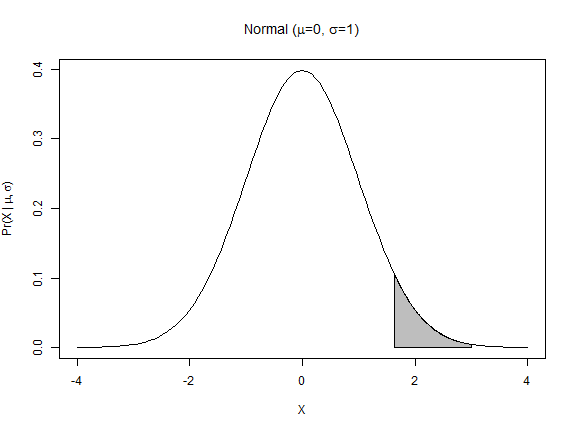

## Presentation

The Distribution Calculator app was developed to teach some basic statistic 
concepts used in biology. It includes some common distributions used in 
biostatistics models and a probablity calculator using the normal distribution
as example.

The distributions included are the following:

* Binomial
* Exponential
* Geometric
* Poisson
* Normal

---

## Density and CDF curves

The app draw the densitity curve for each distribution using an independent
formula in the `functions.R` script; for continuous distributions, the
Cumulative Distribution Function (CDF) is also plot.

For example, the Poisson distribution function:


```r
poiss <- function(m, plotLine, plotMean, limits) {
  m <- as.numeric(m); omega <- 0:1000; probs <- dpois(omega,m)
  plot(omega,probs,type="p", xlab=expression(theta), xlim=limits,
       main=substitute(paste("Poisson (",lambda, "=", m, ")", sep="")),
       ylab=substitute(paste("Pr(", theta, " | ", lambda, ")", sep="")))
  if(plotLine) lines(omega, probs)
  if(plotMean) { range <- (m-trunc(m/2)):(m+trunc(m/2)); meanVal <- m; varVal <- m
    if(limits[2] %in% range) {coord <- 0;just <- c(0,1)} else {coord <- limits[2];just <- c(1,1)}
    text(coord, max(probs), adj=just, cex=1.5,
         substitute(paste(mu, "=", meanVal, "; ", sigma^2, "=", varVal)))
  }}
```

---

## Features in plot

To allow people to understand the concepts of approximations to the other
distributions and the calculation of the mean and variance, some features as the
plot limit (in the previous function, `limits` argument), lines (`plotLine`) and
mean/variance (`plotMean`) could be change:


---

## Probability and p-values

To explain probabilities and obtain *p-value*, an example with the normal
distribution displays the area under the curve for different values. Here I show an example for the upper *p-value* plot for 1.64:



